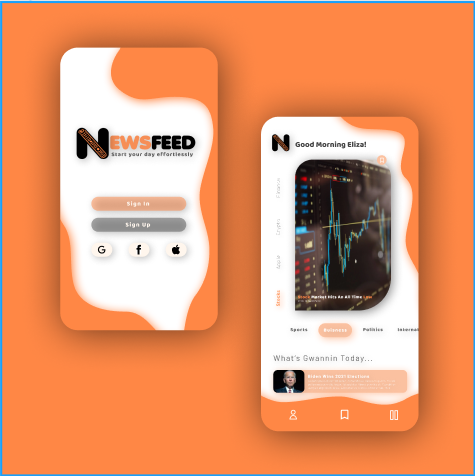

# NewsFeed

## Description
NewsFeed is a web application that allows users to scroll through news titles from a variety of websites of their choosing.
Users can create accounts and create settings that will transist between web browser and phone.

## How I made it
NewsFeed is a MERN application. I created the front end using React Native, and backend was done in an Node.js Express server (not on my github due to privacy concerns) connected to MongoDB hosted on AWS via Mongoose.
News articles are placed into a scroll view from a self developed RSS Feed API. 

## Production timeline
1. Create user interface
2. Set up web app server and database
3. Create Login System 
4. Create RSS API 
5. Link API to React Native Scroll view 
6. Finish **<------ I am here**
